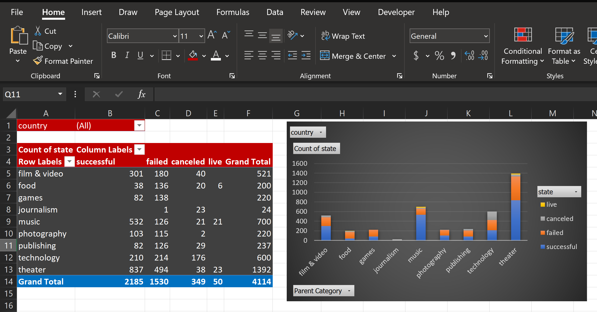
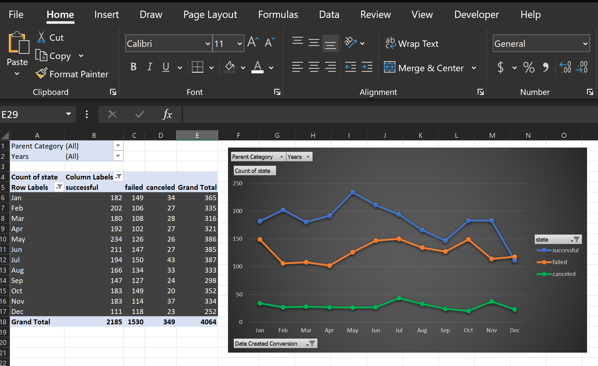
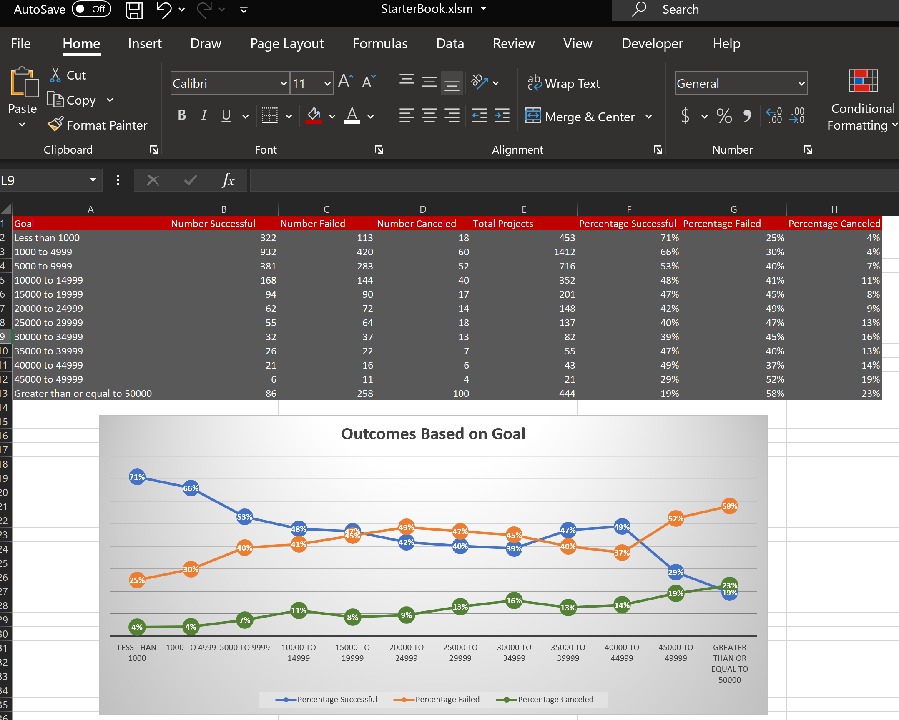

# Project Preview

### Conclusions
Based on the data provided, there are three conclusions that we can draw about Kickstarter campaigns. The first conclusion is that there were more successful projects than failed and canceled projects. Approximately 54% of the projects included in the list was successful and 46% have either failed or have been canceled. Another conclusion that can be drawn from the Kickstarter campaign data is that the greater the goal is, the lower the possibility of successful outcome becomes and the more likely a campaign would fail or get canceled as shown in the ‘Outcome Based on Goal’ graph. Third, the status of the Kickstarter campaigns appears to follow a seasonal trend. For example, in the yearly pivot graph, the amount of canceled, failed, and successful campaigns increased approximately during May through July (summer) and increases again during September through October before the holiday season. This can be helpful for predictive analysis. 

### Dataset Limitations 
One limitation of the dataset that can be considered is that the data is only available for
the years and months included.  The data also does not include the other reasons why the campaigns failed or were canceled. The status is only based on meeting the goals and doesn’t show other reasons why some of the campaigns were canceled or failed. It might be helpful to identify these reasons in order to avoid the failure of other campaigns in the future. Another limitation is the source of the dataset. Since the source is unknown, it can be considered unreliable. The data also doesn’t provide any information regarding why a particular campaign ends at the specified date after gaining a successful outcome. Each campaign ends at different dates and pledged amount but the data does not show why. 

